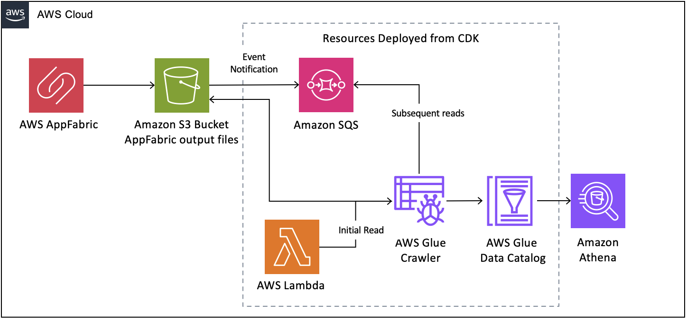

# AppFabric Data Analytics

## What It Is

AppFabric Data Analytics project enables you to maintain logs from various SaaS applications and gives you the ability to search and display the log data. This solution leverages [AWS AppFabric](https://aws.amazon.com/appfabric/) to create a data repository, which you can query with [Amazon Athena](https://aws.amazon.com/athena/). 

AWS Glue crawler will read directly from the AppFabric S3 bucket. Using S3 event notifications, each time a new object is written to S3 - it will be sent to a SQS queue. Glue will pull any new files from the SQS queue. The Glue crawler will then transform the data to optimize Athena queries by creating partitions based on Application, GUID, and date.

## Use-case Scenario

While customers can get normalized & enriched SaaS audit log data (OCSF) from AppFabric, many customers don't want to just ship these logs to a security tool. Some need to preserve logs for post incident analysis. Others need to use those logs to track SaaS subscription/license usage. Still others want to analyze user activity to discover patterns. This project creates a data pipeline that enables customers to build dashboards on top of it.

## Solution Components

On a high-level, the solution consists of the following components, each contained in a separate folder:

* cdk-stacks - AWS CDK stacks:
    - `audit-logs-stack` with all the backend resources needed for the solution (Amazon SQS, AWS Glue, Amazon S3, etc.)

### Solution Architecture:  

### AppFabric Integration

For this project, you will need to choose [any SaaS application that is supported with AppFabric](https://docs.aws.amazon.com/appfabric/latest/adminguide/supported-applications.html) of your choice and connect with AppFabric, so you have S3 bucket with OCSF log files ready to be consumed. 

You can follow the steps from either of the below links to get this AppFabric setup.

* [Getting started with AWS AppFabric for security](https://docs.aws.amazon.com/appfabric/latest/adminguide/getting-started-security.html)
* [Connecting SaaS Application to AWS AppFabric](https://catalog.us-east-1.prod.workshops.aws/workshops/5eef6b5e-7cf0-427b-85fc-1c6ad173db14/en-US/300-appfabric)

## Solution Prerequisites
* AWS Account
* AWS IAM user with Administrator permissions
* Node (v18) and NPM (v8.19) installed and configured on your computer
* AWS CLI (v2) installed and configured on your computer
* AWS CDK (v2) installed and configured on your computer
* S3 bucket with OCSF logs produced by AppFabric 

## Solution Setup

The below instructions show how to deploy the solution using AWS CDK CLI.
These instructions assume you have completed all the prerequisites, and you have an existing Amazon Connect instance, SSO/SAML enabled.

1. Clone the solution to your computer (using `git clone`)

2. Check AWS CLI
    - AWS CDK will use AWS CLI local credentials and region. These can be either
      - environment variables (AWS_ACCESS_KEY_ID AWS_SECRET_ACCESS_KEY, AWS_SESSION_TOKEN, AWS_DEFAULT_REGION) set directly in the command line
      - from a [credentials file](https://docs.aws.amazon.com/cli/latest/userguide/cli-configure-files.html), either using the default profile or setting a specific one (i.e. `export AWS_PROFILE=yourProfile`)
    - check your AWS CLI configuration by running any AWS CLI command (e.g. `aws s3 ls`)
    - you can confirm the configured region with  
            `aws ec2 describe-availability-zones --output text --query 'AvailabilityZones[0].[RegionName]'`
    - AWS SDK (used in the configure script in step 4) can use either the environment variables or credentials file/profile config, however note that the region environment variable in this case is AWS_REGION rather than AWS_DEFAULT_REGION (as used in awscli)

3. Install NPM packages
    - Open your Terminal and navigate to `appfabric-data-analytics/cdk-stacks`
    - Run `npm run install:all`
    - This script goes through all packages of the solution and installs necessary modules (cdk-stacks, lambdas)

4. Configure CDK stacks
    - In your terminal,  navigate to `appfabric-data-analytics/cdk-stacks`
    - Start the configuration script in interactive mode   
      `node configure.js -i`
    - (You can configure it via single command, by directly providing parameters, as described in the script help instructions which you can see by running 
      `node configure.js -h`)
    - When prompted, provide the following parameters:
        - `aws-glue-database-name`: AWS Glue Database to hold tables for AppFabric Data Analytics
        - `appfabric-data-source-s3-uri`: The S3 uri of the data source. All folders and files contained in the S3 path are crawled. For example, enter s3://MyBucket/MyFolder/MySubfolder to crawl all objects in MySubfolder within MyBucket
        - `appfabric-data-source-s3-bucket-name`: The bucket name of the data source

5. Deploy CDK stacks
    - In your terminal navigate to `appfabric-data-analytics/cdk-stacks`
    - If you have started with a new environment, please bootstrap CDK: `cdk bootstrap`
    - Run the script: `npm run cdk:deploy`
    - This script deploys CDK stacks
    - Wait for all resources to be provisioned before continuing to the next step
    - AWS CDK output will be provided in your Terminal (Amazon Cognito User Pool Id, Amazon CloudFront Distribution URL)

6. Wait until the initial Glue Crawler finishes running
    - The Glue crawler runs once automatically after the CDK deployment. 
    - Check the status of the crawler in the Glue Console, under the section "Crawler runs". After the crawler is done running, you will see Athena Glue table created.

7. Test the solution
    - Open your browser and navigate to Amazon Athena
    - Navigate to the query editor, and select yor data source and database
    - For the generated table, select click the three dots, Run Query, then Preview Table
    - Check that the query returns table results 

8. Test the event notifications
   - Generate new data files and add to the data source path
   - Check that new messages are added to the SQS queue and the data points are added to the table

## Clean Up

To remove the solution from your account, please follow these steps:

1. Remove CDK Stacks
    - In your terminal, navigate to appfabric-data-analytics/cdk-stacks
    - Run `cdk destroy --all`

2. Remove deployment parameters from AWS System Manager Parameter Store
    - In your terminal, navigate to appfabric-data-analytics/cdk-stacks
    - Run `node configure.js -d`

## Using This In Production

It is critical that before you use any of this code in Production that you work with your own internal Security and Governance teams to get the appropriate Code and AppSec reviews for your organization. 

Although the code has been written with best practices in mind, your own company may require different ones, or have additional rules and restrictions.

You take full ownership and responsibility for the code running in your environment, and are free to make whatever changes you need to.

## License

This library is licensed under the MIT-0 License. See the LICENSE file.

