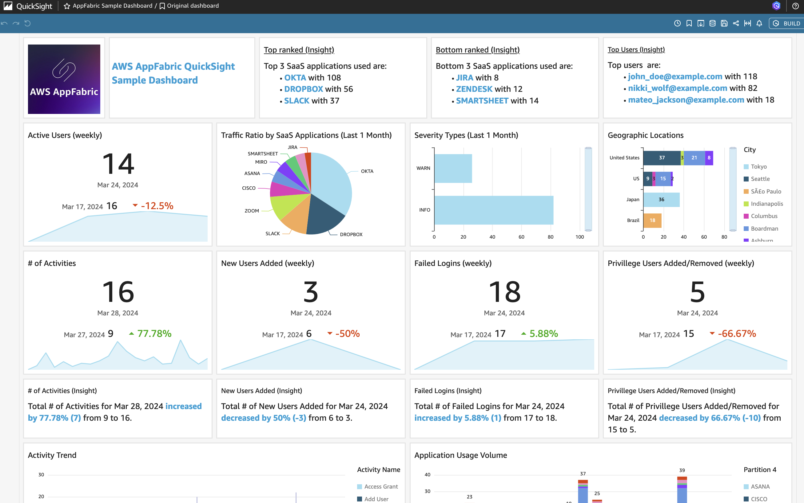
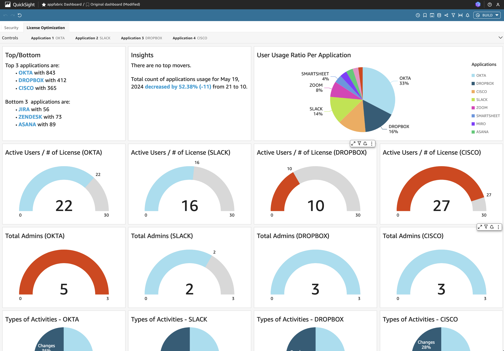
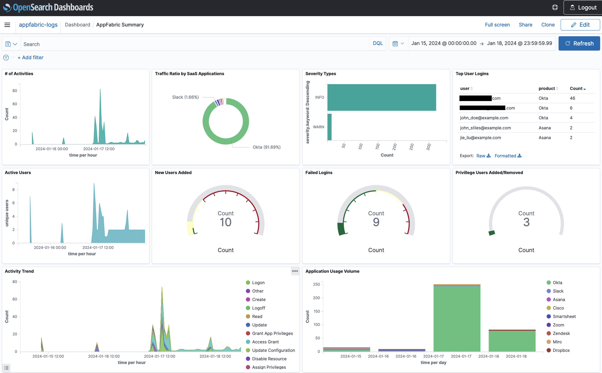
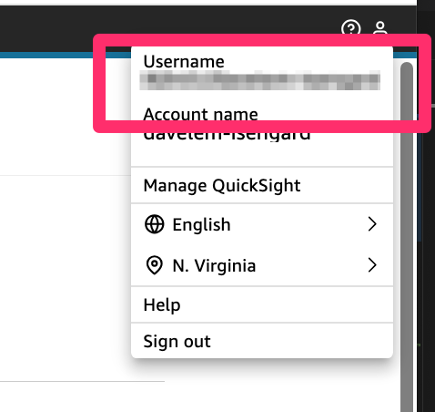

# AppFabric Data Analytics

## What's New

1.1.3 - Added QuickSight dashboard on license optimization 

## What It Is

AppFabric Data Analytics project enables you to maintain logs from various SaaS applications and gives you the ability to search and display the log data on a dashboard. This solution leverages [AWS AppFabric](https://aws.amazon.com/appfabric/) to help ingest and normalize audit logs from your SaaS applications to create data repository.

This solution supports two different analysis options:

1. You can query data with [Amazon Athena](https://aws.amazon.com/athena/) and optionally deploy a sample [Amazon QuickSight](https://aws.amazon.com/quicksight/) dashboard. **If you DO NOT wish to deploy this dashboard, please ignore the (Optional) Quicksight.**

2. You can deploy [Amazon OpenSearch](https://aws.amazon.com/opensearch-service/) dashboard to visualize AppFabric data.  

Sample QuickSight Dashboard

Sample QuickSight Dashboard for License Optimization

Sample OpenSearch Dashboard

## Use-case Scenario

While customers can get normalized & enriched SaaS audit log data (OCSF) from AppFabric, many customers don't want to just ship these logs to a security tool. Some need to preserve logs for post incident analysis. Others need to use those logs to track SaaS subscription/license usage. Still others want to analyze user activity to discover patterns. This project creates a data pipeline and build dashboards that enables customers to customize on top of it.

## Solution Components

On a high-level, the solution consists of the following components, each contained in a separate folder:

* cdk-stacks - AWS CDK stacks:
    - `audit-logs-stack` resources needed to query the data with Amazon Athena
    - `quicksight-stack` resources needed to view the data with Amazon QuickSight dashboard
    - `opensearch-stack` resources needed to view the data with Amazon OpenSearch Serverless dashboard

### Solution Architecture:  
How the `base` architecture works: AWS Glue crawler will read directly from the AppFabric S3 bucket. Using S3 event notifications, each time a new object is written to S3 - it will be sent to a SQS queue. Glue will pull any new files from the SQS queue. The Glue crawler will then transform the data to optimize Athena queries by creating partitions based on Application, GUID, and date.

How the `quicksight` architecture works: Amazon QuickSight dashboard will be built using a prepared template. Amazon QuickSight uses Amazon Athena, prepared from `base` architecture, as source to display data on the dashboard.

How the `opensearch` architecture works: Amazon OpenSearch Serverless dashboard will be built using a prepared template. Amazon Data Firehose is also setup that will directly ingest data to the OpenSearch Serverless to display on the dashboard. You will need to setup the destination of AppFabric to this Firehose delivery stream inorder to ingest the audit logs.

### AppFabric Integration

For this project, you will need to choose [any SaaS application that is supported with AppFabric](https://docs.aws.amazon.com/appfabric/latest/adminguide/supported-applications.html) of your choice and connect with AppFabric, so you have S3 bucket with OCSF log files ready to be consumed. 

You can follow the steps from either of the below links to get this AppFabric setup.

* [Getting started with AWS AppFabric for security](https://docs.aws.amazon.com/appfabric/latest/adminguide/getting-started-security.html)
* [Connecting SaaS Application to AWS AppFabric](https://catalog.us-east-1.prod.workshops.aws/workshops/5eef6b5e-7cf0-427b-85fc-1c6ad173db14/en-US/300-appfabric)

## Solution Prerequisites
* AWS Account
* AWS IAM user with Administrator permissions
* Node (v18) and NPM (v8.19) installed and configured on your computer
* AWS CLI (v2) installed and configured on your computer
* AWS CDK (v2) installed and configured on your computer
* S3 bucket with OCSF logs produced by AppFabric 
* Docker [installed](https://docs.docker.com/get-docker/) (for deploying OpenSearch only; used for packaging python libraries to Lambda function)

## Solution Setup (Amazon Athena)
The below instructions show how to deploy the solution using AWS CDK CLI. If you are using a Windows device please use the Git BASH terminal and use alternative commands where highlighted.

These instructions assume you have completed all the prerequisites, and you have an existing Amazon Connect instance, SSO/SAML enabled.

1. Clone the solution to your computer (using `git clone`)

2. Check AWS CLI
    - AWS CDK will use AWS CLI local credentials and region. These can be either
      - environment variables (AWS_ACCESS_KEY_ID AWS_SECRET_ACCESS_KEY, AWS_SESSION_TOKEN, AWS_DEFAULT_REGION) set directly in the command line
      - from a [credentials file](https://docs.aws.amazon.com/cli/latest/userguide/cli-configure-files.html), either using the default profile or setting a specific one (i.e. `export AWS_PROFILE=yourProfile`)
    - check your AWS CLI configuration by running any AWS CLI command (e.g. `aws s3 ls`)
    - you can confirm the configured region with  
            `aws ec2 describe-availability-zones --output text --query 'AvailabilityZones[0].[RegionName]'`
    - AWS SDK (used in the configure script in step 4) can use either the environment variables or credentials file/profile config, however note that the region environment variable in this case is AWS_REGION rather than AWS_DEFAULT_REGION (as used in awscli)

3. Install NPM packages
    - Open your Terminal and navigate to `appfabric-data-analytics/cdk-stacks`
    - Run `npm run install:all`
    - This script goes through all packages of the solution and installs necessary modules (cdk-stacks, lambdas)

5. Configure CDK stacks
    - In your terminal,  navigate to `appfabric-data-analytics/cdk-stacks`
    - Start the configuration script in interactive mode   
      `node configure.js -i`
    - (You can configure it via single command, by directly providing parameters, as described in the script help instructions which you can see by running 
      `node configure.js -h`)
    - When prompted, provide the following parameters:
        - `aws-glue-database-name`: AWS Glue Database to hold tables for AppFabric Data Analytics
        - `appfabric-data-source-s3-uri`: The S3 uri of the data source. All folders and files contained in the S3 path are crawled. For example, enter s3://MyBucket/MyFolder/MySubfolder to crawl all objects in MySubfolder within MyBucket
        - `athena-query-storage-s3-uri`: The S3 Bucket and Path (s3://MyBucket/Path/) of where Athena should store query results.  Query output will be encrypted using AWS Managed Keys
        - `quicksight-admin-username`: Ignore for now...this will be populated when deploying the optional QuickSight stack below.

6. Deploy CDK stacks
    - In your terminal navigate to `appfabric-data-analytics/cdk-stacks`
    - If you have started with a new environment, please bootstrap CDK: `cdk bootstrap`
    - Deploy the CDK Stack
        - Run the script: `npm run cdk:deploy:base`
            - On Windows devices use `cdk:deploy:gitbash:base`
    - Wait for all resources to be provisioned before continuing to the next step
    - AWS CDK output will be provided in your Terminal 

7. Wait until the initial Glue Crawler finishes running
    - The Glue crawler runs once automatically after the CDK deployment. 
    - Check the status of the crawler in the Glue Console, under the section "Crawler runs". After the crawler is done running, you will see Athena Glue table created.

8. Test the solution
    - Open your browser and navigate to Amazon Athena
    - Navigate to the query editor, and select yor data source and database
    - For the generated table, select click the three dots, Run Query, then Preview Table
    - Check that the query returns table results 

9. Test the event notifications
   - Generate new data files and add to the data source path
   - Check that new messages are added to the SQS queue and the data points are added to the table

## Solution Setup (QuickSight Dashboard)

> Note: Before deploying this stack, you need to deploy the [Solution Setup (Amazon Athena)](#solution-setup-amazon-athena) solution first and wait untill the Glue Crawler in the previous step finishes running. The Glue crawler runs once automatically after the CDK deployment. Check the status of the crawler in the Glue Console, under the section "Crawler runs". After the crawler is done running, you will see Athena Glue table created.

1. Configure Quicksight (Optional)
    - Make note of the S3 buckets used for AppFabric Above and Athena Query Results.  If a bucket for Athena Query results doesn't already exist, please create one.
    - Configure QuickSight
        - If QuickSight hasn't been configured, please [Configure QuickSight](quicksight-configuration/README.md#new-quicksight-setup)
        - If QuickSight is already configured please verify [Amazon Athena and Amazon S3 are configured services](quicksight-configuration/README.md#adding-s3-and-athena-to-quicksight-services)
    - Make note of Quicksight Admin Username 
        - While in Quicksight select the user icon at the top-right of the screen and copy the Username which looks like: `Admin/[Username]`
        

2. Configure CDK stacks
    - In your terminal,  navigate to `appfabric-data-analytics/cdk-stacks`
    - Start the configuration script in interactive mode   
      `node configure.js -i`
    - When prompted, provide the following parameters:
        - `aws-glue-database-name`: AWS Glue Database to hold tables for AppFabric Data Analytics
        - `appfabric-data-source-s3-uri`: The S3 uri of the data source. All folders and files contained in the S3 path are crawled. For example, enter s3://MyBucket/MyFolder/MySubfolder to crawl all objects in MySubfolder within MyBucket
        - `athena-query-storage-s3-uri`: The S3 Bucket and Path (s3://MyBucket/Path/) of where Athena should store query results.  Query output will be encrypted using AWS Managed Keys
        - `quicksight-admin-username`: The Quicksight Principal Username copied in the previous step.  Should look like `Admin/[Quicksight Username]`

3. Deploy CDK stacks
    - In your terminal navigate to `appfabric-data-analytics/cdk-stacks`
    - Deploy the QuickSight CDK Stack: `npm run cdk:deploy:quicksight`
        - On Windows devices use `cdk:deploy:gitbash:quicksight`
    - Wait for all resources to be provisioned before continuing to the next step

4. Test the solution
    - Navigate to QuickSight, Select Dashboards, and Open the `appfabric dashboard`

## Solution Setup (OpenSearch Serverless Dashboard)

1. Deploy CDK stacks
    - In your terminal navigate to `appfabric-data-analytics/cdk-stacks`
    - Deploy the QuickSight CDK Stack: `npm run cdk:deploy:opensearch`
        - On Windows devices use `cdk:deploy:gitbash:opensearch`
    - Wait for all resources to be provisioned before continuing to the next step

2. Test the solution
    - Navigate to OpenSearch Serverless, Select Collections, and Open the `appfabric-cdk`
    - By default, you will not see any data on the dashboard as no data has been ingested yet. Since Amazon Data Firehose is already setup with this deployment, you can [setup AppFabric output location as Amazon Data Firehose](https://docs.aws.amazon.com/appfabric/latest/adminguide/prerequisites.html#create-output-location) to ingest data from your [SaaS application of your choice](https://docs.aws.amazon.com/appfabric/latest/adminguide/supported-applications.html).
    - You also need to adjust the date range of the dashboard to span the dates associated to your ingested data.

## Clean Up

To remove the solution from your account, please follow these steps:

1. Remove CDK Stacks
    - In your terminal, navigate to appfabric-data-analytics/cdk-stacks
    - Run `cdk destroy --all`

2. Remove deployment parameters from AWS System Manager Parameter Store
    - In your terminal, navigate to appfabric-data-analytics/cdk-stacks
    - Run `node configure.js -d`

## Using This In Production

It is critical that before you use any of this code in Production that you work with your own internal Security and Governance teams to get the appropriate Code and AppSec reviews for your organization. 

Although the code has been written with best practices in mind, your own company may require different ones, or have additional rules and restrictions.

You take full ownership and responsibility for the code running in your environment, and are free to make whatever changes you need to.

