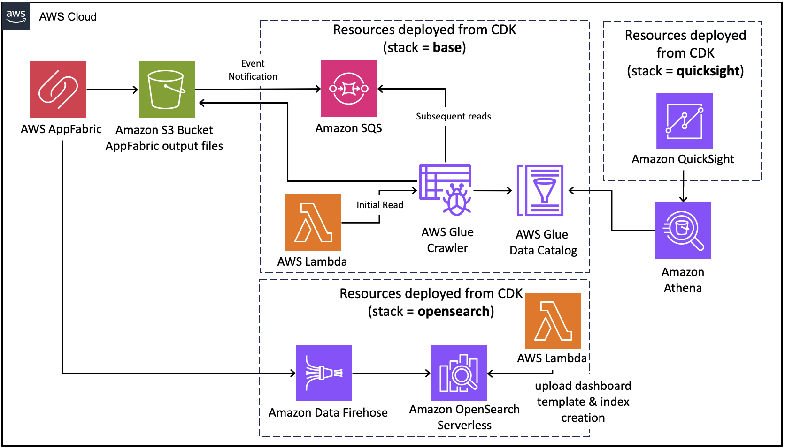

# AppFabric データ分析

[View this page in English](README.md)

## 新機能

1.1.5 - 日本語への対応
1.1.4 - ライセンス最適化に関するQuickSightダッシュボードを追加

## 概要

AppFabricデータ分析プロジェクトは、さまざまなSaaSアプリケーションからログを保持し、ダッシュボードでログデータを検索および表示する機能を提供します。このソリューションは、[AWS AppFabric](https://aws.amazon.com/appfabric/)を利用して、SaaSアプリケーションから監査ログを取り込み、正規化してデータリポジトリを作成します。

このソリューションは、次の2つの分析オプションをサポートします：

1. [Amazon Athena](https://aws.amazon.com/athena/)でデータをクエリし、必要に応じてサンプルの[Amazon QuickSight](https://aws.amazon.com/quicksight/)ダッシュボードをデプロイします。**このダッシュボードをデプロイしない場合は、（オプションの）QuickSightを無視してください。**

2. AppFabricデータを視覚化するために[Amazon OpenSearch](https://aws.amazon.com/opensearch-service/)ダッシュボードをデプロイします。

サンプルQuickSightダッシュボード

ライセンス最適化のためのサンプルQuickSightダッシュボード

サンプルOpenSearchダッシュボード

## ユースケース

AppFabricから正規化および強化されたSaaS監査ログデータ（OCSF）を取得できる一方で、これらのログをセキュリティツールに送信するだけでなく、インシデント後の分析のためにログを保存したり、SaaSサブスクリプション/ライセンス使用状況を追跡したり、ユーザー活動を分析してパターンを発見したりする必要があります。このプロジェクトはデータパイプラインを作成し、その上でユーザーがカスタマイズできるダッシュボードを構築します。

## ソリューションコンポーネント

このソリューションは次のコンポーネントで構成されており、それぞれが別々のフォルダーに含まれています：

* cdk-stacks - AWS CDKスタック：
    - `audit-logs-stack` はAmazon Athenaを使用してデータをクエリ検索するために必要なリソース
    - `quicksight-stack` はQuickSightダッシュボードでデータを表示するために必要なリソース
    - `opensearch-stack` はOpenSearch Serverlessダッシュボードでデータを表示するために必要なリソース

### ソリューションアーキテクチャ:  
`base` アーキテクチャの動作：AWS Glueクローラーが直接AppFabric S3バケットから読み取ります。S3イベント通知を使用して、新しいオブジェクトがS3に書き込まれるたびにSQSキューに送信されます。GlueはSQSキューから新しいファイルを引き出し、Glueクローラーはデータを変換してAthenaクエリを最適化し、アプリケーション、GUID、および日付に基づいてパーティションを作成します。

`quicksight` アーキテクチャの動作：準備されたテンプレートを使用してAmazon QuickSightダッシュボードを構築します。Amazon QuickSightは、baseアーキテクチャから準備されたAmazon Athenaをソースとしてダッシュボードにデータを表示します。

`opensearch` アーキテクチャの動作：準備されたテンプレートを使用してAmazon OpenSearch Serverlessダッシュボードを構築します。Amazon Data Firehoseも設定されており、データをOpenSearch Serverlessに直接取り込み、ダッシュボードに表示します。監査ログを取り込むために、AppFabricの宛先をこのFirehose配信ストリームに設定する必要があります。

### AppFabric インテグレーション

このプロジェクトでは、[AppFabricでサポートされている任意のSaaSアプリケーション](https://docs.aws.amazon.com/appfabric/latest/adminguide/supported-applications.html)を選択し、AppFabricと接続する必要があります。これにより、OCSFログファイルが格納されたS3バケットが用意され、消費できるようになります。

以下のいずれかのリンクからAppFabricのセットアップ手順を参照できます。

* [AWS AppFabricを使用したセキュリティの入門](https://docs.aws.amazon.com/appfabric/latest/adminguide/getting-started-security.html)
* [SaaSアプリケーションをAWS AppFabricに接続](https://catalog.us-east-1.prod.workshops.aws/workshops/5eef6b5e-7cf0-427b-85fc-1c6ad173db14/en-US/300-appfabric)

または、こちらの[AppFabric サンプルログジェネレーター](https://github.com/aws-samples/appfabric-sample-log-generator)を利用することで、サンプルで複数のSaaSアプリケーションからのOCSF化された監査ログを取得できます。まずは（AppFabricから出力されたような）サンプルデータでダッシュボードを見てみたいという方にはお勧めです。

## ソリューションの前提条件
* AWSアカウント
* 管理者権限を持つAWS IAMユーザー
* コンピューターにインストールおよび設定されたNode（v18）およびNPM（v8.19）
* コンピューターにインストールおよび設定されたAWS CLI（v2）
* コンピューターにインストールおよび設定されたAWS CDK（v2）
* AppFabricによって生成されたOCSFログを含むS3バケット
* Dockerの[インストール](https://docs.docker.com/get-docker/)（OpenSearchのデプロイのみ；Lambda関数にPythonライブラリをパッケージ化するために使用）

## ソリューションセットアップ（Amazon Athena）
以下の手順は、AWS CDK CLIを使用してソリューションをデプロイする方法を示しています。Windowsデバイスを使用している場合は、Git BASHターミナルを使用し、強調表示された代替コマンドを使用してください。

これらの手順は、すべての前提条件を完了していることを前提としています。

1. ソリューションをコンピューターにクローンする（`git clone`を使用）

2. AWS CLIを確認する
    - AWS CDKはAWS CLIのローカル認証情報とリージョンを使用します。これらは、以下のいずれかの方法で設定できます
      - コマンドラインに直接設定された環境変数（AWS_ACCESS_KEY_ID、AWS_SECRET_ACCESS_KEY、AWS_SESSION_TOKEN、AWS_DEFAULT_REGION）
      - [認証情報ファイル](https://docs.aws.amazon.com/cli/latest/userguide/cli-configure-files.html)から、デフォルトプロファイルを使用するか、特定のプロファイルを設定する（例：`export AWS_PROFILE=yourProfile`）
    - 任意のAWS CLIコマンドを実行してAWS CLIの設定を確認します（例：`aws s3 ls`）
    - 次のコマンドを実行して設定されたリージョンを確認します 
            `aws ec2 describe-availability-zones --output text --query 'AvailabilityZones[0].[RegionName]'`
    - AWS SDKは環境変数または認証情報ファイル/プロファイル構成のいずれかを使用できますが、この場合のリージョン環境変数はAWS_DEFAULT_REGIONではなくAWS_REGIONであることに注意してください（awscliで使用される場合）

3. NPMパッケージをインストールする
    - ターミナルを開き、`appfabric-data-analytics/cdk-stacks`に移動します
    - `npm run install:all`を実行します
    - このスクリプトは、ソリューションのすべてのパッケージを通過し、必要なモジュール（cdk-stacks、lambdas）をインストールします

5. CDKスタックを設定する
    - ターミナルで、`appfabric-data-analytics/cdk-stacks`に移動します
    - 設定スクリプトを開始します
      `node configure.js -i`
    - (シングルコマンドでパラメータを直接指定して設定することもできます。`node configure.js -h`を実行すると表示されるスクリプトのヘルプ指示に従ってください)
    - プロンプトに従って、以下のパラメータを提供します：
        - `aws-glue-database-name`: AppFabricデータ分析のためのAWS Glueデータベース
        - `appfabric-data-source-s3-uri`: データソースのS3 URI。S3パス内のすべてのフォルダーとファイルがクロールされます。例えば、s3://MyBucket/MyFolder/MySubfolder を入力すると、MyBucket内のMySubfolderにあるすべてのオブジェクトがクロールされます
        - `athena-query-storage-s3-uri`: Athenaがクエリ結果を保存するS3バケットとパス（s3://MyBucket/Path/ ）。クエリ出力はAWS管理キーを使用して暗号化されます
        - `quicksight-admin-username`: 今は無視してください…これは後でオプションのQuickSightスタックをデプロイする際に入力します

6. CDKスタックをデプロイする
    - ターミナルで `appfabric-data-analytics/cdk-stacks` に移動します
    - 新しい環境で開始した場合は、CDKをブートストラップします： `cdk bootstrap`
    - CDKスタックをデプロイします
        - スクリプトを実行します： `npm run cdk:deploy:base`
            - Windowsデバイスでは `cdk:deploy:gitbash:base`を使用します
    - すべてのリソースがプロビジョニングされるまで待ち、次のステップに進みます
    - AWS CDKの出力はターミナルに表示されます

7. 初回のGlueクローラーが完了するまで待つ
    - CDKデプロイメント後、Glueクローラーは自動的に1回実行されます。
    - Glueコンソールの「Crawler runs」セクションでクローラーのステータスを確認します。クローラーが完了すると、Athena Glueテーブルが作成されます。

8. ソリューションをテストする
    - ブラウザを開き、Amazon Athenaに移動します
    - クエリエディターに移動し、データソースとデータベースを選択します
    - 生成されたテーブルについて、三つの点をクリックし、クエリを実行し、テーブルをプレビューします
    - クエリがテーブルの結果を返すことを確認します

9. イベント通知をテストする
   - 新しいデータファイルを生成し、データソースパスに追加します
   - SQSキューに新しいメッセージが追加され、データポイントがテーブルに追加されることを確認します

## ソリューションセットアップ（QuickSightダッシュボード）

> 注：このスタックをデプロイする前に、まず[ソリューションセットアップ（Amazon Athena）](#ソリューションセットアップamazon-athena)をデプロイし、前のステップでGlueクローラーが完了するまで待つ必要があります。CDKデプロイメント後、Glueクローラーは自動的に1回実行されます。Glueコンソールの「クローラーの実行」セクションでクローラーのステータスを確認します。クローラーが完了すると、Athena Glueテーブルが作成されます。

1. QuickSightの設定（オプション）
    - 上記のAppFabricとAthenaクエリ結果に使用するS3バケットをメモします。Athenaクエリ結果用のバケットが既に存在しない場合は、新しいバケットを作成してください。
    - QuickSightの設定
        - QuickSightが設定されていない場合は、[QuickSightの設定](quicksight-configuration/README.md#new-quicksight-setup)を行います
        - QuickSightが既に設定されている場合は、[Amazon AthenaとAmazon S3が構成されているサービス](quicksight-configuration/README.md#adding-s3-and-athena-to-quicksight-services)を確認してください
    - QuickSight管理者ユーザー名をメモします
        - QuickSightで右上のユーザーアイコンを選択し、`Admin/[Username]`の形式で表示されるユーザー名をコピーします
        

2. CDKスタックを設定する
    - ターミナルで `appfabric-data-analytics/cdk-stacks` に移動します
    - 対話モードで設定スクリプトを開始します   
      `node configure.js -i`
    - プロンプトに従って、以下のパラメータを提供します：
        - `aws-glue-database-name`: AppFabricデータ分析のためのAWS Glueデータベース
        - `appfabric-data-source-s3-uri`: データソースのS3 URI。S3パス内のすべてのフォルダーとファイルがクロールされます。例えば、s3://MyBucket/MyFolder/MySubfolder を入力すると、MyBucket内のMySubfolderにあるすべてのオブジェクトがクロールされます
        - `athena-query-storage-s3-uri`: Athenaがクエリ結果を保存するS3バケットとパス（s3://MyBucket/Path/）。クエリ出力はAWS管理キーを使用して暗号化されます
        - `quicksight-admin-username`: 前のステップでコピーしたQuickSightプリンシパルユーザー名。`Admin/[QuickSight Username]` の形式で入力します
        - `lang-option`: 存在する場合に使用されるダッシュボードテンプレートの言語。現在サポートされている言語は[en, ja]です。デフォルトは'en'です

3. CDKスタックをデプロイする
    - ターミナルで `appfabric-data-analytics/cdk-stacks` に移動します
    - QuickSight CDKスタックをデプロイします： `npm run cdk:deploy:quicksight`
        - Windowsデバイスでは `cdk:deploy:gitbash:quicksight` を使用してください
    - すべてのリソースがプロビジョニングされるまで待ち、次のステップに進みます

4. ソリューションをテストする
    - QuickSightに移動し、ダッシュボードを選択し、`appfabric dashboard` を開きます

## ソリューションセットアップ（OpenSearch Serverlessダッシュボード）

1. CDKスタックをデプロイする
    - ターミナルで `appfabric-data-analytics/cdk-stacks` に移動します
    - OpenSearch CDKスタックをデプロイします：`npm run cdk:deploy:opensearch`
        - Windowsデバイスでは `cdk:deploy:gitbash:opensearch` を使用します
        - 注意: Docker関連のエラーが表示されたら、恐らくDockerを起動していないのが原因です。[前提条件](#ソリューションの前提条件)を再度確認ください
    - すべてのリソースがプロビジョニングされるまで待ち、次のステップに進みます

2. ソリューションをテストする
    - OpenSearch Serverlessに移動し、コレクションを選択し、`appfabric-cdk`を開きます
    - デフォルトでは、ダッシュボードにはデータが表示されません。まだデータが取り込まれていないためです。Amazon Data Firehoseはこのデプロイメントで既に設定されているため、データを取り込むために[AppFabric出力場所をAmazon Data Firehoseとして設定]((https://docs.aws.amazon.com/appfabric/latest/adminguide/prerequisites.html#create-output-location))し、[任意のSaaSアプリケーション](https://docs.aws.amazon.com/appfabric/latest/adminguide/supported-applications.html)からデータを取り込みます。
    - ダッシュボードの日付範囲を取り込んだデータに合わせて調整する必要があります

## クリーンアップ

アカウントからソリューションを削除するには、次の手順に従います：

1. CDKスタックを削除する
    - ターミナルで`appfabric-data-analytics/cdk-stacks`に移動します
    - `cdk destroy --all`を実行します

2. AWSシステムマネージャーパラメーターストアからデプロイメントパラメーターを削除する
    - ターミナルで`appfabric-data-analytics/cdk-stacks`に移動します
    - `node configure.js -d`を実行します

## 本番環境での使用

このコードを本番環境で使用する前に、内部のセキュリティおよびガバナンスチームと協力して、適切なコードおよびアプリケーションセキュリティレビューを受けることが重要です。

コードはベストプラクティスを念頭に置いて書かれていますが、各社は異なる要件を持っていたり、追加のルールや制約がある場合があります。

環境で実行されるコードについては、完全に所有権と責任を持ち、必要に応じて変更を加えることができます。

